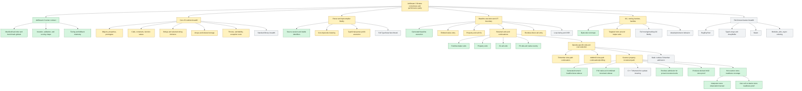

# Octane Dependency Map

This is a compact status map for the Rust JSC rewrite. Keep detailed evidence in
`progress.md`; keep durable process in `002-bfs-rewrite-plan.md`.

```mermaid
flowchart TD
    Goal["JetStream 3 Octane correctness and performance parity"]:::wip

    Goal --> Runner["JetStream 3 runner contract"]:::done
    Goal --> Runtime["Core JS runtime breadth"]:::wip
    Goal --> Parser["Parser and bytecompiler fidelity"]:::wip
    Goal --> Baseline["Baseline execution and JIT boundary"]:::wip
    Goal --> GC["GC, rooting, barriers, handles"]:::wip
    Goal --> FullBreadth["Full-Octane feature breadth"]:::pending

    Runner --> RunnerLoad["Manifest/load order and benchmark globals"]:::done
    Runner --> RunnerScore["Iteration, validation, and scoring shape"]:::done
    Runner --> RunnerTelemetry["Tiering and fallback telemetry"]:::done

    Runtime --> Objects["Objects, properties, prototypes"]:::wip
    Runtime --> Calls["Calls, constructs, function values"]:::wip
    Runtime --> Strings["Strings and selected string intrinsics"]:::wip
    Runtime --> Arrays["Arrays and indexed storage"]:::wip
    Runtime --> Exceptions["Throws, catchability, exception roots"]:::wip
    Runtime --> StandardLib["Standard library breadth"]:::pending

    Parser --> SourceSession["Source session and stable identifiers"]:::done
    Parser --> BytecodeLowering["Core bytecode lowering"]:::wip
    Parser --> TypeScriptPrefix["TypeScript parser-prefix execution"]:::wip
    Parser --> FullTypeScript["Full TypeScript benchmark"]:::pending

    Baseline --> Generated["Generated baseline execution"]:::done
    Baseline --> NativeEntry["Emitted native entry"]:::wip
    Baseline --> ICs["Property and call ICs"]:::wip
    Baseline --> RetainedExits["Retained exits and continuations"]:::wip
    Baseline --> Rootless["Rootless direct-call entry"]:::wip
    Baseline --> LoopTiering["Loop tiering and OSR"]:::pending

    RetainedExits --> RuntimeHelperExits["Runtime-helper exits"]:::done
    RetainedExits --> PropertyExits["Property exits"]:::done
    RetainedExits --> JSCallExits["JS-call exits"]:::done
    RetainedExits --> SideExitReentry["P6 side-exit native reentry"]:::done
    RetainedExits --> SideExitCost["Opcode-specific side-exit cost reduction"]:::wip

    SideExitCost --> ToNumberSlow["ToNumber slow-path continuation"]:::wip
    SideExitCost --> AddSlow["AddInt32 slow-path continuation/profiling"]:::wip
    SideExitCost --> ScannerIncrement["Scanner property-increment path"]:::wip
    SideExitCost --> StaticToNumberRootless["Static rootless ToNumber admission"]:::pending

    ScannerIncrement --> GeneratedIncrementSidecar["Generated numeric load/inc/store sidecar"]:::done
    ScannerIncrement --> P10IncrementSidecar["P10 native-exit combined increment sidecar"]:::done
    ScannerIncrement --> ToNumericIncLowering["C++ ToNumeric/Inc update lowering"]:::pending
    ScannerIncrement --> IncrementRootlessAdmission["Rootless admission for proven increment exits"]:::done
    ScannerIncrement --> IncrementProducerProof["Producer-derived Int32 store proof"]:::done
    ScannerIncrement --> IncrementReadinessCoverage["Hot scanner store-readiness coverage"]:::done
    IncrementReadinessCoverage --> StoreObservationHarvest["Interpreter store observation harvest"]:::done
    IncrementReadinessCoverage --> NonCellBarrierProof["Non-cell no-barrier store readiness proof"]:::done

    GC --> RootMaps["Bytecode root maps"]:::done
    GC --> TargetedRoots["Targeted roots around helper exits"]:::wip
    GC --> MovingGC["Full moving/marking GC fidelity"]:::pending
    GC --> WeakRefs["Weak/ephemeron behavior"]:::pending

    FullBreadth --> RegExp["RegExp/Yarr"]:::pending
    FullBreadth --> TypedArrays["Typed arrays and ArrayBuffer"]:::pending
    FullBreadth --> Wasm["Wasm"]:::pending
    FullBreadth --> ModulesJobs["Modules, jobs, async ordering"]:::pending

    classDef done fill:#d5f5df,stroke:#247a3d,color:#102a17;
    classDef wip fill:#fff2bf,stroke:#9a6b00,color:#2b2100;
    classDef pending fill:#f1f3f5,stroke:#6c757d,color:#212529;
```
